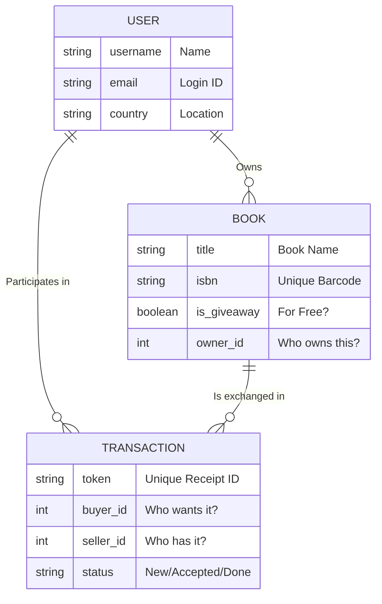

# System Design (Student Edition)

This document explains **HOW** the project works. Think of it as the "Blueprint" of the application.

## 1. High-Level Architecture (The Big Picture)

Our system is split into two main parts: the **Frontend (What you see)** and the **Backend (The Logic)**. They talk to each other using API calls.

```mermaid
graph TD
    User((User))
    Browser[Web Browser]
    
    subgraph "The 'Box' (Docker)"
        Frontend[Frontend / Nuxt.js\n(The Waiter)]
        Backend[Backend / Django\n(The Kitchen)]
        DB[(PostgreSQL Database\n(The Fridge))]
    end
    
    ExtAPI[Google Books API\n(The Library Catalog)]

    %% Interactions
    User -->|Clicks Button| Browser
    Browser -->|1. Asks for Page| Frontend
    Browser -->|2. Asks for Data (JSON)| Backend
    
    Backend -->|Saves/Reads Data| DB
    Backend -->|Looks up Book Details| ExtAPI
```

### Simple Explanation
1.  **Frontend (Nuxt.js):** Runs on port `3000`. It acts like a **Waiter**. It shows you the menu (pages) and takes your order (clicks).
2.  **Backend (Django):** Runs on port `8000`. It acts like the **Chef**. It receives the order, cooks the food (processes logic), and authenticates who you are.
3.  **Database (PostgreSQL):** Acts like the **Fridge**. It keeps the ingredients (Users, Books) safe and cold (organized).
4.  **Docker:** The "Box" that holds the Waiter, Chef, and Fridge together so they can travel to any computer.

---

## 2. Database Design (How we store data)

We store data in **Tables** (like Excel sheets) that are connected to each other.



### The Relationships Explained
*   **1 User -> Many Books:** A single user (like you) can upload 10 different books to their profile.
*   **Transaction:** This is the magic link. It connects a **Buyer** + **Seller** + **Book**. It's like a receipt that tracks the deal from "Requested" to "Completed".

---

## 3. How Data Moves (The Story of a Swap)

Let's imagine **Alice** wants a book from **Bob**.

### Step 1: The Request
*   **Alice** clicks "Request Swap".
*   **Frontend** sends a message to Backend: *"Hey, User #1 (Alice) wants Book #50 from User #2 (Bob)."*
*   **Backend** checks: "Does Alice have permission? Yes." -> Creates a **Transaction** record (Status: `PENDING`).

### Step 2: The Notification
*   **Bob** logs in.
*   **Backend** tells Frontend: *"Hey, Bob has 1 new notification."*
*   Bob sees "Alice wants your Harry Potter book."

### Step 3: The Exchange
*   **Bob** clicks "Accept".
*   **Backend** updates the Transaction status to `ACCEPTED`.
*   *(Optional Future Step)*: The system could email Alice saying "Good news! Bob accepted."

---

## 4. Security (Keeping it Safe)

1.  **Secret Tokens (UUIDs):**
    *   Instead of numbering transactions like `#1`, `#2`, `#3`, we use long random codes (like `a1b2-c3d4...`).
    *   **Why?** So a hacker can't guess transaction #4 just by adding 1 to transaction #3.

2.  **The "bouncer" (CORS):**
    *   Our Backend has a list of allowed visitors. It only talks to our Frontend (`localhost:3000`). If a hacker tries to connect from `evil-site.com`, the Backend blocks them.

3.  **No Naked Passwords:**
    *   We never save passwords like `monkeys123`. We turn them into gibberish `xd87&^%...` (Hashing) so even if someone steals the database, they can't login as you.
