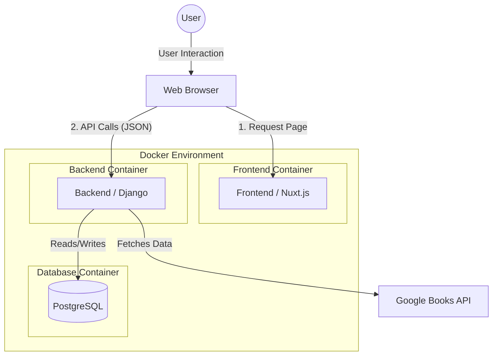
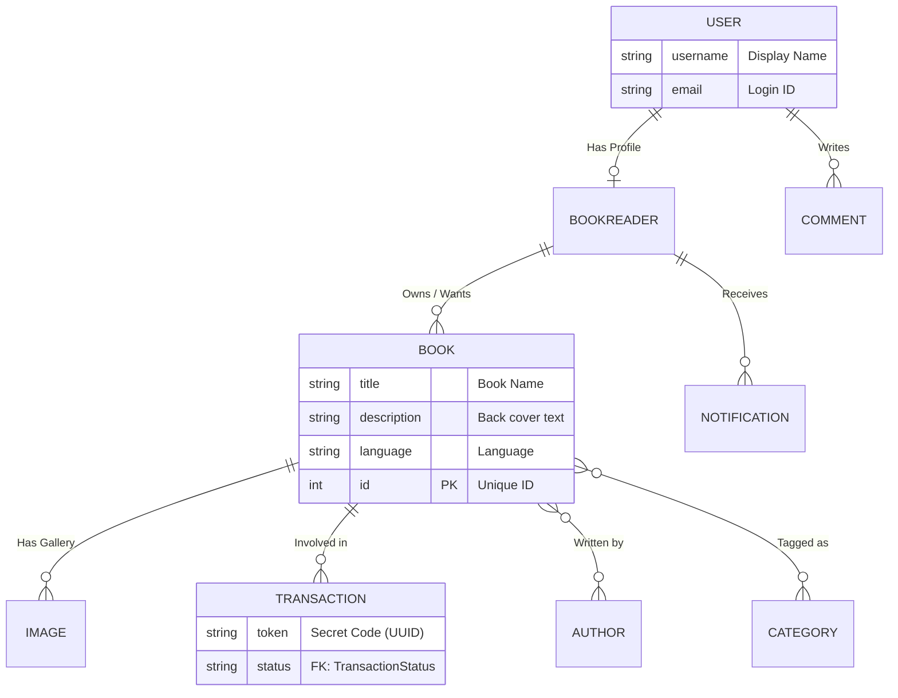

# System Design

This document explains the technical implementation of the project.

## 1. High-Level Architecture

The system is split into two main parts: the **Frontend** and the **Backend**. They communicate using API calls.

### Component Overview
1.  **Frontend (Nuxt.js):** Runs on port `3000`. It provides the user interface and handles user interactions.
2.  **Backend (Django):** Runs on port `8000`. It processes business logic and performs authentication.
3.  **Database (PostgreSQL):** Stores application data such as Users, Books, and Transactions.
4.  **Docker:** Provides a multi-container environment for consistent execution across different systems.

---

## 2. Database Design (How we store data)

We store data in **Tables** (like Excel sheets) that are connected to each other.

### The Relationships Explained
*   **One-to-One (User -> Profile):** Every user account has exactly one profile (BookReader) for their settings and country.
*   **One-to-Many (Book -> Images):** Each book can have many images in its gallery.
*   **Many-to-Many (Book -> Authors/Categories):** A book can have multiple authors, and an author can write multiple books. Similarly for categories.

---

## 3. How Data Moves

Imagine **Alice** wants a book from **Bob**.

### Step 1: The Discovery
*   **Alice** searches for "Harry Potter". The **Frontend** asks the **Backend**.
*   The **Backend** looks in the **Fridge (DB)** and tells Alice: "Bob has it on his Giveaway shelf!"

### Step 2: The Request
*   Alice clicks "Propose Exchange".
*   The **Backend** creates a **Transaction** (Status: `PENDING`).
*   The **Backend** also adds a **Notification** for Bob.

### Step 3: The Acceptance
*   **Bob** clicks "Accept". The status changes to `ACCEPTED`.
*   Both users see each other's details to arrange the physical exchange.

---

## 4. Security

1.  **UUIDs for Transactions:**
    *   Instead of `#1`, `#2`, we use `a1b2-c3d4...`. It’s unguessable, so hackers can't "creep" on other people's matches.

2.  **Bouncer (CORS):**
    *   The Backend only allows requests from our trusted Frontend. Anyone else is blocked at the door.

3.  **Password Hashing:**
    *   We don't store passwords. we store a "scrambled" version. Even if the database is stolen, your password remains a secret.
